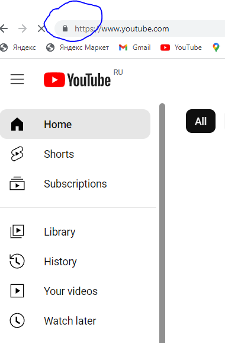
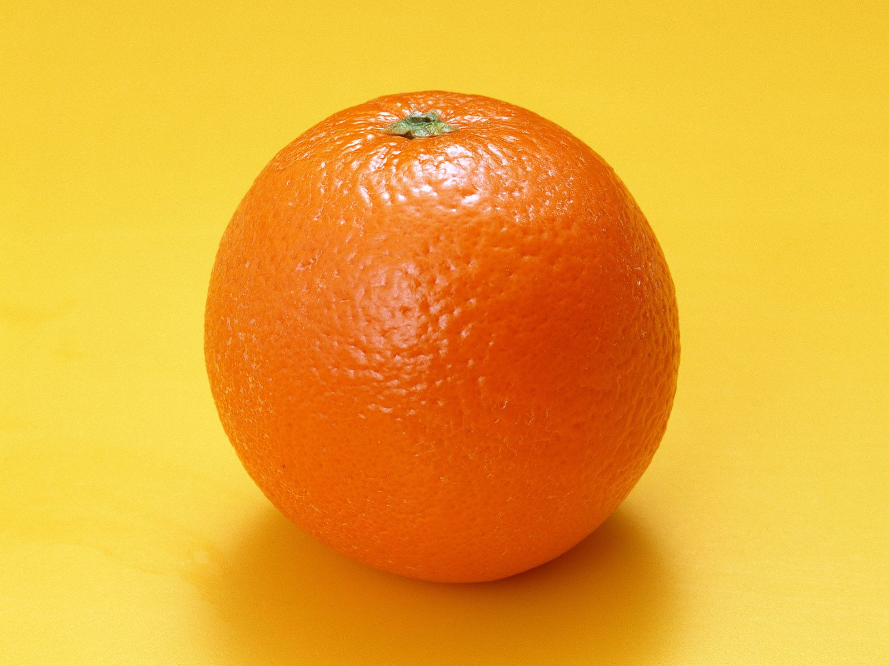

# Вопрос
## 1. Определите, на каком протоколе работает сайт youtube.com.

### скриншот с названием 1_protocol.jpg, по которому  понятно, что протокол сайта https://:

или 

Чтобы добавить ссылку необходимо ввести символы: ( [ ) ( ] )()
[Давайте кататься на лыжах](article-name.md)

[Все в сад!](article-name.md)

### Header 4 

 Выделение текста жирным -  пара символов в начале и в конце
Например **Вот так**

Чтобы сделать курсив,
необходимо использовать символ (*) в начале и в конце,
<<<<<<< HEAD
Например *Вот так*

Перечёркнутый текст обозначается парой символов (~) в начале и парой (~) в конце;
Например ~~Вот так~~

Списки в Markdown:
Обозначаются символами (*) или (+) или (-) в начале строки, 
Например:
+ Элемент 1
+ Элемент 2
+ Элемент 3

Нумерованный список:
1. Элемент 1
2. Элемент 2
3. Элемент 3

Разместить картнку:

>>>>>>> lists-ins
=======
### Header 4

Чтобы оформить таблицу, необходимо использовать символы (|) и (-)
Например:

|Fruit   | Fresh  | Where grow | Taste|
|--------|--------|------------|------ |
| Apple  |Yes     | Grandma garden|    |
| Cherry |Yes     | Grandpa garden|Sour|
|  Orange| Yes    | Africa      |Sweet |
---------------------------------------
| Mango  | Yes    | America    |Sour  | 
--------|---------|------------|-------

Например *Вот так* 
 text-ins
